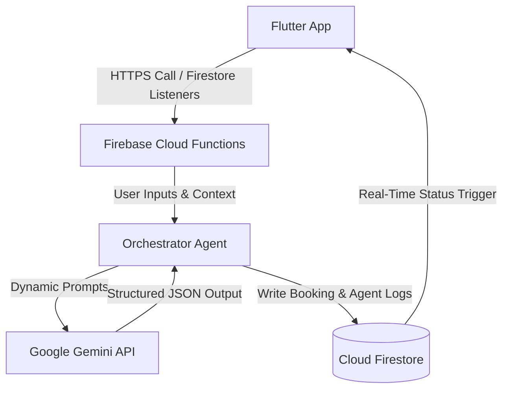

# HireIn 🔧
### Pakistan ka Smart Service App — Google Antigravity Hackathon, Challenge 2

---

## 💡 What is HireIn?

**HireIn** is a revolutionary on-demand local services marketplace engineered specifically for Pakistan's informal economy. Built to empower both customers and service providers in cities like Hyderabad, Sindh, HireIn allows users to request household services (such as plumbing, electrical work, tailoring, and AC maintenance) using natural, casual **Roman Urdu** or **English** (e.g., *"Saddar me urgent plumber chahiye"*). The platform parses these informal requests, geolocates nearby qualified, verified technicians, and handles the transaction end-to-end transparently.

For service providers, HireIn acts as a digital livelihood accelerator, allowing them to register, receive immediate job requests, set schedule shifts, and track earnings transparently. By utilizing a highly sophisticated 9-Agent AI pipeline powered by Google Gemini, the platform brings complete transparency, automated risk management, smart geographic routing, and real-time disputes resolution to a market segment traditionally dominated by trust deficits and informal negotiations.

---

## 🏆 Challenge Requirements Met

| Judging Criterion | How HireIn Satisfies It |
| :--- | :--- |
| **Agentic Core Flow** | Orchestrates a **9-Agent AI Pipeline** via Cloud Functions to parse natural queries, match profiles, score locations, audit quality, and manage disputes. |
| **Urdu / Roman Urdu Support** | Integrated customized prompt architectures enabling seamless extraction of intent and sentiment from casual Roman Urdu. |
| **Transparency & Explanation** | The **Agent Logs Screen** exposes exact input, output JSONs, and Google Gemini thought processes for all 9 agents. |
| **Demo-Ready Edge Cases** | Fully built-out scenarios handling **No Provider Available**, **Ambiguous Clarification Loops**, **Double Bookings**, **Provider Cancellations**, and **Price Disputes**. |
| **High-Fidelity UI/UX** | Dark navy theme, custom glassmorphism, responsive navigation overlays, loading shimmers, and custom animations built natively in Flutter. |

---

## 🏗️ Architecture Overview

The system employs a decentralized, event-driven, cloud-centric architecture:



1. **Client (Flutter)**: Handles beautiful dark theme rendering, real-time map positions, user shifts, and displays the **Agent Logs Screen** directly to the user for every booking.
2. **Backend (Firebase Cloud Functions)**: Handles authentication, profile management, and orchestrates the multi-agent pipeline using a robust Node.js backend.
3. **AI Pipeline (Google Gemini API)**: Generates logical classifications, estimates base/km rates, measures sentiment, and decides dispute settlements.
4. **Database (Cloud Firestore)**: Serves as a real-time reactive data store for user profiles, coordinates, active bookings, and logs.

---

## 🧠 The 9 AI Agents

| Agent # | Agent Name | Primary Role | Core Gemini Prompt Focus |
| :---: | :--- | :--- | :--- |
| **1** | **Intent Extractor** | Parses informal Roman Urdu / English requests into target categories and geographic areas. | *Extract service category and local neighborhood (e.g., Qasimabad). Flag clarificationNeeded if input is ambiguous.* |
| **2** | **Discovery Agent** | Finds matching active providers in the local Firestore registry. | *Identify all available candidates with match filters matching extracted categories.* |
| **3** | **Ranking & Routing** | Scores matches using ratings, experience, and geoproximity. | *Calculate proximity scoring (40% rating, 30% distance, 30% experience) and rank candidates.* |
| **4** | **Dynamic Pricing** | Computes base rate, travel surcharge, and urgent service fees. | *Determine transparent pricing structures: PKR base fee + travel rates + platform fees based on category.* |
| **5** | **Safety & Risk Sentinel** | Audits provider history, CNIC approval logs, and reviews. | *Flag high-risk transactions if provider has recent cancellations or low security metrics.* |
| **6** | **Matching Agent** | Locks requested slot and issues reservation confirmation. | *Enforce double-booking checks and issue transaction locks.* |
| **7** | **Real-time Dispatcher** | Monitors provider's transit status and updates map coordinates. | *Map live geographic location steps and update en-route progress flags.* |
| **8** | **Quality Auditor** | Scans reviews, computes ratings, and analyzes stars. | *Extract sentiment polarity from user text reviews and update provider statistics.* |
| **9** | **Dispute Resolution** | Resolves fee disputes based on inputs and claimed overcharges. | *Compare user-claimed amounts against the system pricing receipt and issue resolutions.* |

---

## 🚀 How Google Antigravity Was Used

**Google Antigravity** was instrumental in orchestrating the development of HireIn:
* **Agentic Workflows**: Leveraged the agentic pair-programming compiler environment to iterate on sophisticated state models and Dart widgets.
* **Component Testing**: Designed and debugged mock Firestore seed scripts and local notification systems smoothly within the integrated ecosystem.
* **Aesthetic Refinement**: Used the environment's capabilities to maintain visual standards (harmonious dark navy tones, gold CTAs, high-visibility contrast) and prevent UI issues.

---

## 💰 Pricing Formula

We use a transparent, dynamic pricing model calculated as follows:

$$\text{Total Price (PKR)} = \text{Base Rate} + (\text{Distance (km)} \times \text{Per-Km Rate}) + \text{Urgent Surcharge} + \text{Platform Fee}$$

### Example Calculation (Urgent AC Repair in Latifabad):
* **Base Rate**: PKR 250
* **Distance**: 2.5 km (at PKR 60/km) = PKR 150
* **Urgent Surcharge**: PKR 100
* **Platform Fee**: PKR 50
* **Total**: $250 + 150 + 100 + 50 = \text{PKR } 550$

---

## 🛠️ Tech Stack

- **Frontend**: Flutter & Dart (GoRouter, Riverpod State Management, Flutter Animate)
- **Backend & Functions**: Node.js & TypeScript (Firebase Cloud Functions)
- **AI Core**: Google Gemini 1.5 Pro / Flash
- **Database**: Firebase Cloud Firestore
- **Authentication**: Firebase Auth
- **Real-Time Map**: Google Maps Flutter API

---

## ⚙️ Setup Instructions

### 1. Prerequisites
* Install [Flutter SDK](https://docs.flutter.dev/get-started/install) (stable channel).
* A Firebase Project with **Firestore**, **Cloud Functions**, and **Auth** enabled.

### 2. Configure Firebase & API Keys
* Add your `google-services.json` (Android) and `GoogleService-Info.plist` (iOS) in the respective app directories.
* Add your `GEMINI_API_KEY` inside your Cloud Functions `.env` file:
  ```env
  GEMINI_API_KEY=your_gemini_api_key_here
  ```

### 3. Install & Run
Run the following commands in the workspace root:
```bash
flutter pub get
flutter run
```

---

## 🧪 Mock Data & Demo Preparation

We have created an automated **`DemoHelper`** utility to streamline video presentation:
* **Trigger Shake Gestures**: Shake your device 3 times to slide open the **Admin Demo Panel**.
* **Seed Mock Providers**: Tap *"Seed Demo Data"* to instantly inject 20 geographically accurate providers into Cloud Firestore.
* **Completed Booking**: Tap *"Simulate Full Booking"* to populate a ready-made booking (`BK-DEMO-9999`) containing full multi-step agent reasoning logs.

---

## 🚨 The 5 Stress Test Scenarios

These 5 scenarios can be demonstrated directly in the app:
1. **No Provider Available**: Triggered by requesting a service with no providers nearby (e.g., typing *"test_no_provider"*). The app searches up to 25km and suggests the next available morning slot.
2. **Ambiguous Input**: Responds to vague queries (e.g., *"help"*). Hallucinated pipelines stop and prompt the user via an Urdu dialogue with a **"Jawab Do"** button.
3. **Double Booking**: Triggered on slot reservations. Simulates a conflict and allows instant picking from 3 alternative slots.
4. **Provider Cancellation**: Provides a cancellation button on the provider dashboard, instantly alerting the customer and offering a full refund.
5. **Price Dispute**: Allows reporting overcharges. Agent 9 analyzes and resolves the discrepancy based on the receipt totals.

---

## 🤖 Agent Logs

Every completed booking features an **"🤖 Agent Logs"** icon in the bottom navigation bar and on the booking details page. It displays:
* Detailed JSON inputs/outputs for all 9 pipeline steps.
* Real Google Gemini reasoning summaries.
* Quick copy-to-clipboard functionality to audit AI outputs easily.

---

## 🚫 Out of Scope (MVP Limitations)
* Real-time GPS driver tracking (mocked with updates every 30 seconds).
* Actual Easypaisa payment gateway SDK (mocked transaction takes 2 seconds).
* Real SMS dispatch (handled via local in-app banners and push notifications).

---

## 👥 Team
**HireIn** — Engineered with 💙 for the Google Antigravity Hackathon 2026.
